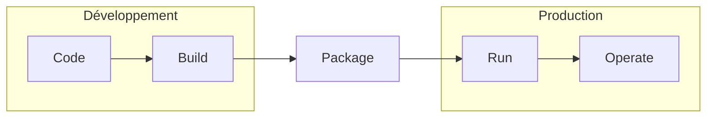
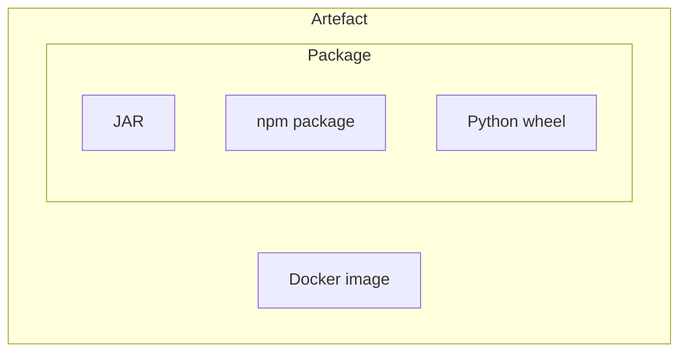

# Artéfact

DevOps

---

## Cycle de vie d'un programme



---

## Package

- &shy;<!-- .element: class="fragment" --> **Contrat** entre le développeur et l'opérateur
- &shy;<!-- .element: class="fragment" --> **Format** de livraison
- &shy;<!-- .element: class="fragment" --> Exemples :
  - &shy;<!-- .element: class="fragment" --> .jar, .war, .ear (Java)
  - &shy;<!-- .element: class="fragment" --> .apk (Android)
  - &shy;<!-- .element: class="fragment" --> .exe, .dll (Windows)
  - &shy;<!-- .element: class="fragment" --> .html, .css, .js (Web)

---

### Dépendances

- &shy;<!-- .element: class="fragment" --> Besoin de libraries **externes** ?
- &shy;<!-- .element: class="fragment" --> Comment les **gérer** et les **distribuer** ?
- &shy;<!-- .element: class="fragment" --> **Gestionnaire de paquets**
- &shy;<!-- .element: class="fragment" --> Fichier de configuration (liste des dépendances)
  - &shy;<!-- .element: class="fragment" --> pom.xml (Maven)
  - &shy;<!-- .element: class="fragment" --> package.json (npm)
  - &shy;<!-- .element: class="fragment" --> requirements.txt (pip)

---

#### Gestionnaire de paquets

- &shy;<!-- .element: class="fragment" --> Maven, Gradle (Java)
- &shy;<!-- .element: class="fragment" --> npm, pnpm, yarn (Node.js)
- &shy;<!-- .element: class="fragment" --> APT (Advanced Packaging Tool) (Linux)
- &shy;<!-- .element: class="fragment" --> pip, Poetry (Python)

---

### Configuration

- &shy;<!-- .element: class="fragment" --> Comment **run** le programme ?
- &shy;<!-- .element: class="fragment" --> Quel **OS** ?
- &shy;<!-- .element: class="fragment" --> Quelle **version** ?
- &shy;<!-- .element: class="fragment" --> Quelle **commande** ?
  - &shy;<!-- .element: class="fragment" --> Quels **arguments** ?

---

## Mieux qu'un paquet ?

- &shy;<!-- .element: class="fragment" --> Souhait : Code + Dépendances + Configuration
- &shy;<!-- .element: class="fragment" --> Solution 1 : Machine virtuelle ?
  - &shy;<!-- .element: class="fragment" --> Problème : **lourd** et **lent**
- &shy;<!-- .element: class="fragment" --> Solution 2 : **OS-level** virtualization (Conteneur)

---

## Conteneur vs machine virtuelle


https://www.docker.com/resources/what-container/ <!-- .element: class="reference" target="_blank" -->

---

## Conteneur

- &shy;<!-- .element: class="fragment" --> Partage le **noyau** de l'OS
- &shy;<!-- .element: class="fragment" --> **Isolation** des ressources (fichiers, processus, ...)
- &shy;<!-- .element: class="fragment" --> **Léger** (distribution) et **rapide** (démarrage)
- &shy;<!-- .element: class="fragment" --> **Docker** (leader)
  - &shy;<!-- .element: class="fragment" --> Entreprise **privée**
  - &shy;<!-- .element: class="fragment" --> Construit sur des technologies **pré-existante** (namespaces, cgroups, ...)
- &shy;<!-- .element: class="fragment" --> **Podman** (alternative)
  - &shy;<!-- .element: class="fragment" --> Projet **open-source**

---


<p class="reference">
  <a href="https://commons.wikimedia.org/wiki/File:Docker-linux-interfaces.svg">User:Maklaan</a>, Public domain, via Wikimedia Commons
</p>

---


https://jfrog.com/devops-tools/article/understanding-and-building-docker-images/ <!-- .element: class="reference" target="_blank" -->

---

### Dockerfile

```dockerfile
FROM python:3

WORKDIR /usr/src/app

COPY requirements.txt ./
RUN pip install --no-cache-dir -r requirements.txt

COPY . .

CMD [ "python", "./your-daemon-or-script.py" ]
```

- &shy;<!-- .element: class="fragment" --> Recette pour **construire** une image
- &shy;<!-- .element: class="fragment" --> [Bonnes pratiques](https://docs.docker.com/develop/develop-images/dockerfile_best-practices/) sur le site de Docker <!-- .element: target="_blank" -->

---

### Couches

[](https://docs.docker.com/build/guide/layers/) <!-- .element: target="_blank" -->

- &shy;<!-- .element: class="fragment" --> Image = couches de **diff** de fichiers

---

### Cache des couches

[](https://docs.docker.com/build/guide/layers/) <!-- .element: target="_blank" -->

- &shy;<!-- .element: class="fragment" --> **Ordre** des couches pour le **cache**
- &shy;<!-- .element: class="fragment" --> Du plus **stable** (dépendances)
  au plus **volatile** (code)

---

### Container

[](https://docs.docker.com/storage/storagedriver/) <!-- .element: target="_blank" -->

- &shy;<!-- .element: class="fragment" --> **Partage** des couches entre les containers

---

### Multi-stage builds

```dockerfile [1-4|6-9|7]
FROM maven:3.5.0-jdk-8-alpine AS builder
ADD ./pom.xml pom.xml
ADD ./src src/
RUN mvn clean package

FROM openjdk:8-jre-alpine
COPY --from=builder target/my-app.jar my-app.jar
EXPOSE 8080
CMD ["java", "-jar", "my-app.jar"]
```

- &shy;<!-- .element: class="fragment" --> **Compiler** dans une image
  - &shy;<!-- .element: class="fragment" --> **Léger** (pas de JDK dans l'image finale)
- &shy;<!-- .element: class="fragment" --> **Réutiliser** des couches

---

### Taille des images

- &shy;<!-- .element: class="fragment" --> Taille de l'image = **somme** des couches
- &shy;<!-- .element: class="fragment" --> Inclure que les fichiers **nécessaire**
- &shy;<!-- .element: class="fragment" --> Utiliser les **multi-stage builds**
- &shy;<!-- .element: class="fragment" --> Préférer la version **alpine** des images
  - &shy;<!-- .element: class="fragment" --> [Alpine Linux](https://alpinelinux.org/) <!-- .element: target="_blank" --> est une distribution **légère**
    - &shy;<!-- .element: class="fragment" --> `python:3.11` ~360 Mo
    - &shy;<!-- .element: class="fragment" --> `python:3.11-alpine` ~18 Mo
  - &shy;<!-- .element: class="fragment" --> Moins de packages **pré-installés**
  - &shy;<!-- .element: class="fragment" --> Parfois des problèmes de **compatibilité**

---

### Dockerignore

- &shy;<!-- .element: class="fragment" --> Lors d'un build : `docker build -t my-image .`
- &shy;<!-- .element: class="fragment" --> Envoi de tous les fichiers du **context** (répertoire courant) au **daemon**
- &shy;<!-- .element: class="fragment" --> Utiliser un fichier [.dockerignore](https://docs.docker.com/engine/reference/builder/#dockerignore-file) pour **exclure** des fichiers -> build plus rapide
- &shy;<!-- .element: class="fragment" --> Exemple :
  ```
  # Ignore all files
  *
  # Allow files and directories
  !src/
  !pom.xml
  ```

---

### Docker Hub

- &shy;<!-- .element: class="fragment" --> [Docker Hub](https://hub.docker.com/) <!-- .element: target="_blank" -->
  - &shy;<!-- .element: class="fragment" --> **Registre** d'images Docker
  - &shy;<!-- .element: class="fragment" --> **Public** et **privé** (payant)
- &shy;<!-- .element: class="fragment" --> Préférez les images **officielles**

---

## Artefact

- &shy;<!-- .element: class="fragment" --> **Résultat** d'un **build**
- &shy;<!-- .element: class="fragment" --> Terme **générique** (pas de format spécifique) du paquet

---

### Artefact vs Package



---

## Gestionnaire d'artefacts

- &shy;<!-- .element: class="fragment" --> [Sonatype Nexus Repository](https://www.sonatype.com/nexus-repository-sonatype) <!-- .element: target="_blank" -->
  - &shy;<!-- .element: class="fragment" --> [Version OSS](https://www.sonatype.com/nexus-repository-oss) (open-source software) <!-- .element: target="_blank" -->
- &shy;<!-- .element: class="fragment" --> [JFrog Artifactory](https://jfrog.com/artifactory/) <!-- .element: target="_blank" -->
  - &shy;<!-- .element: class="fragment" --> Version payante plus complète que Nexus

---

## Versioning

- &shy;<!-- .element: class="fragment" --> [Semantic Versioning](https://semver.org/) <!-- .element: target="_blank" -->
  - &shy;<!-- .element: class="fragment" --> `MAJOR.MINOR.PATCH`
  - &shy;<!-- .element: class="fragment" --> `1.0.0`
  - &shy;<!-- .element: class="fragment" --> `1.0.1` (bug fix)
  - &shy;<!-- .element: class="fragment" --> `1.1.0` (new feature)
  - &shy;<!-- .element: class="fragment" --> `2.0.0` (breaking change)
- &shy;<!-- .element: class="fragment" --> Utilisé par les **gestionnaires de paquets**
  - &shy;<!-- .element: class="fragment" --> `^1.0.0` (>= 1.0.0 &lt; 2.0.0)
  - &shy;<!-- .element: class="fragment" --> `~1.0.0` (>= 1.0.0 &lt; 1.1.0)

---

### Docker Image Tag

- &shy;<!-- .element: class="fragment" --> `latest`
  - &shy;<!-- .element: class="fragment" --> Par **défaut** si non spécifié
- &shy;<!-- .element: class="fragment" --> `1.3.2`
  - &shy;<!-- .element: class="fragment" --> Spécifique à une **version** précise
  - &shy;<!-- .element: class="fragment" --> Pas de mise à jour des **patch** de **sécurité** automatiquement
- &shy;<!-- .element: class="fragment" --> `1.3`
  - &shy;<!-- .element: class="fragment" --> Spécifique à une version **minor**
  - &shy;<!-- .element: class="fragment" --> **Recommandé** car **stable** et **sécurisé**
  - &shy;<!-- .element: class="fragment" --> Selon les projets, plutôt fixer la version **major**

---

## Fichier lock

- &shy;<!-- .element: class="fragment" --> **Verrouille** les versions des dépendances
- &shy;<!-- .element: class="fragment" --> Exemples :
  - &shy;<!-- .element: class="fragment" --> `package-lock.json` (npm)
  - &shy;<!-- .element: class="fragment" --> `poetry.lock` (Poetry)
- &shy;<!-- .element: class="fragment" --> À **versionner** dans le dépôt de code
