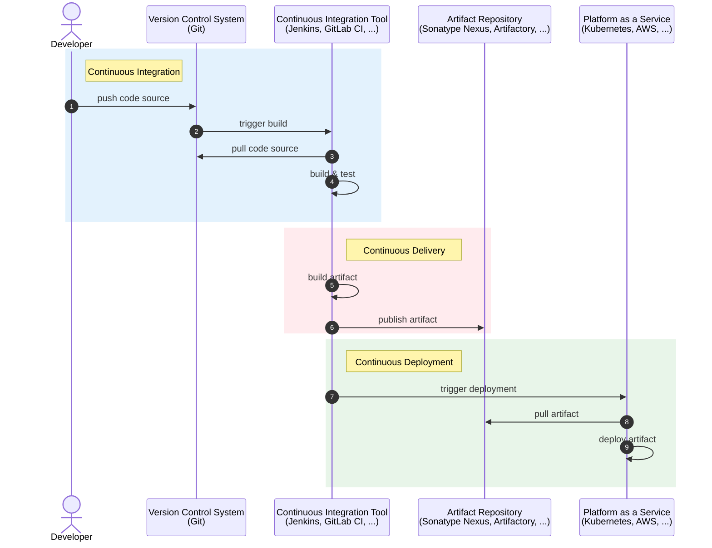

# CI/CD

DevOps

---

## CI/CD = ?

- &shy;<!-- .element: class="fragment" --> CI: Continuous **Integration**
  - Intégration continue
- &shy;<!-- .element: class="fragment" --> CD: Continuous **Delivery**
  - Distribution continue
- &shy;<!-- .element: class="fragment" --> CD: Continuous **Deployment**
  - Déploiement continu

---

## Continuous Integration

- Problème :
  - &shy;<!-- .element: class="fragment" --> **Plusieurs** développeurs sur le même projet
  - &shy;<!-- .element: class="fragment" --> **Intégration** des modifications dans un code **commun**
  - &shy;<!-- .element: class="fragment" --> Intégration des **services**
- Solution :
  - &shy;<!-- .element: class="fragment" --> **Automatiser** l'intégration
    - &shy;<!-- .element: class="fragment" --> La **construction/compilation** (build)
    - &shy;<!-- .element: class="fragment" --> Les **tests**

---

## Continuous Delivery

- &shy;<!-- .element: class="fragment" --> **Automatiser** la **distribution** du logiciel
  - &shy;<!-- .element: class="fragment" --> Création de l'**artefact** (jar, Docker image, etc.)
  - &shy;<!-- .element: class="fragment" --> **Publication** de l'artefact (npm, pip, Docker Hub, etc.)

---

## Continuous Deployment

- &shy;<!-- .element: class="fragment" --> **Automatiser** le **déploiement** du logiciel
  - &shy;<!-- .element: class="fragment" --> **Installation** de l'artefact sur l'environnement de **production**
  - &shy;<!-- .element: class="fragment" --> **Mise à jour** du logiciel

---


https://www.redhat.com/fr/topics/devops/what-is-ci-cd <!-- .element: class="reference" target="_blank" -->

---

## CD vs CD


https://www.atlassian.com/continuous-delivery/principles/continuous-integration-vs-delivery-vs-deployment <!-- .element: class="reference" target="_blank" -->

---



---

## Outils

- &shy;<!-- .element: class="fragment" --> [Jenkins](https://www.jenkins.io/) <!-- .element: target="_blank" -->
  - &shy;<!-- .element: class="fragment" --> Open source & on-premise
  - &shy;<!-- .element: class="fragment" --> Jobs lancés sur un serveur (aujourd'hui aussi possible sur un container)
- &shy;<!-- .element: class="fragment" --> [GitHub Actions](https://github.com/features/actions) <!-- .element: target="_blank" -->
  - &shy;<!-- .element: class="fragment" --> Intégré à GitHub
- &shy;<!-- .element: class="fragment" --> [GitLab CI/CD](https://docs.gitlab.com/ee/ci/) <!-- .element: target="_blank" -->
  - &shy;<!-- .element: class="fragment" --> Intégré à GitLab

---

## GitLab CI/CD

- &shy;<!-- .element: class="fragment" --> **Pipeline**
  - &shy;<!-- .element: class="fragment" --> **Stage** (build, test, deploy, etc.)
    - &shy;<!-- .element: class="fragment" --> **Job** contient un **script** exécuté par un **runner** dans un **container**


---

### `.gitlab-ci.yml`

```yaml
build-job:
  stage: build
  script:
    - echo "Hello, $GITLAB_USER_LOGIN!"

test-job1:
  stage: test
  script:
    - echo "This job tests something"

test-job2:
  stage: test
  script:
    - echo "This job tests something, but takes more time than test-job1."
    - echo "After the echo commands complete, it runs the sleep command for 20 seconds"
    - echo "which simulates a test that runs 20 seconds longer than test-job1"
    - sleep 20

deploy-prod:
  stage: deploy
  script:
    - echo "This job deploys something from the $CI_COMMIT_BRANCH branch."
  environment: production
```

---

### Job et stage

- **Job** définit **quoi** exécuter (script)
  - &shy;<!-- .element: class="fragment" --> Condition avec `rules`
  - &shy;<!-- .element: class="fragment" --> Dépendance avec `needs`
- **Stage** définit **quand** exécuter un job
  - &shy;<!-- .element: class="fragment" --> **Ordre** des stages (par défaut) :
    - `.pre` > `build` > `test` > `deploy` > `.post`

---

### Variables

- &shy;<!-- .element: class="fragment" --> **Variables d'environnement** injectées dans les jobs
  - &shy;<!-- .element: class="fragment" --> `CI_COMMIT_BRANCH`,`CI_COMMIT_REF_NAME`, `CI_PIPELINE_SOURCE`, etc.
  - &shy;<!-- .element: class="fragment" --> [Predefined variables reference](https://docs.gitlab.com/ee/ci/variables/predefined_variables.html) <!-- .element: target="_blank" -->
- &shy;<!-- .element: class="fragment" --> Définition de ses propres variables

---

### Trigger une pipeline

- &shy;<!-- .element: class="fragment" --> Sur un **push** sur une branche
- &shy;<!-- .element: class="fragment" --> Sur une **merge request**
- &shy;<!-- .element: class="fragment" --> **Régulièrement** (cron)
- &shy;<!-- .element: class="fragment" --> **webhook** sur l'API
- &shy;<!-- .element: class="fragment" --> **Manuellement** depuis l'interface
- &shy;<!-- .element: class="fragment" --> Depuis une **autre pipeline**

---

### Artifacts

- &shy;<!-- .element: class="fragment" --> A la fin de chaque **job**, possibilité de **sauvegarder** des **artefacts**
  - &shy;<!-- .element: class="fragment" --> Fichiers ou dossiers
- &shy;<!-- .element: class="fragment" --> Possibilité de **récupérer** les artefacts d'un job dans un autre
- &shy;<!-- .element: class="fragment" --> Possibilité de **télécharger** les artefacts depuis l'interface
- &shy;<!-- .element: class="fragment" --> [Job artifacts](https://docs.gitlab.com/ee/ci/jobs/job_artifacts.html) <!-- .element: target="_blank" -->

---

### Cache

- &shy;<!-- .element: class="fragment" --> Possibilité de **cacher** des fichiers ou dossiers entre les **exécutions** d'un même job
  - &shy;<!-- .element: class="fragment" --> [Caching](https://docs.gitlab.com/ee/ci/caching/) <!-- .element: target="_blank" -->
- &shy;<!-- .element: class="fragment" --> Accélère les **exécutions** des jobs
- &shy;<!-- .element: class="fragment" --> Utilisé pour les **dépendances** (node_modules, .m2, etc.)

---

### DRY !

- &shy;<!-- .element: class="fragment" --> DRY = Don't Repeat Yourself
- &shy;<!-- .element: class="fragment" --> Vous pouvez **réutiliser** des pipelines
  - &shy;<!-- .element: class="fragment" --> [extends](https://docs.gitlab.com/ee/ci/yaml/#extends) pour réutiliser un job (de la même pipeline) <!-- .element: target="_blank" -->
    - &shy;<!-- .element: class="fragment" --> [YAML anchors](https://docs.gitlab.com/ee/ci/yaml/yaml_optimization.html#anchors) <!-- .element: target="_blank" -->
  - &shy;<!-- .element: class="fragment" --> [include](https://docs.gitlab.com/ee/ci/yaml/#include) pour réutiliser un fichier externe <!-- .element: target="_blank" -->

---

### Runner

- &shy;<!-- .element: class="fragment" --> Un **agent** qui exécute les jobs sur un serveur
  - &shy;<!-- .element: class="fragment" --> **SaaS** runners sur GitLab.com
    - &shy;<!-- .element: class="fragment" --> limité puis payant
  - &shy;<!-- .element: class="fragment" --> **Self-managed** runners
    - &shy;<!-- .element: class="fragment" --> illimité mais à gérer
- &shy;<!-- .element: class="fragment" --> [GitLab Runner](https://docs.gitlab.com/runner/) <!-- .element: target="_blank" -->

---

### Référence

https://docs.gitlab.com/ee/ci/yaml/ <!-- .element: target="_blank" -->
