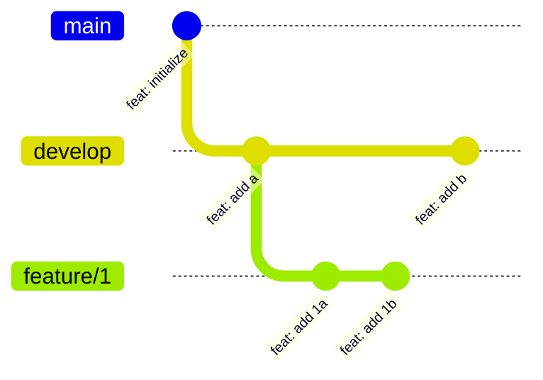
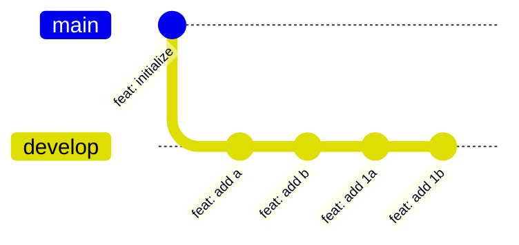
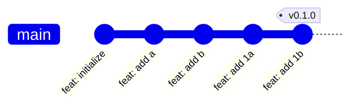

# Code

DevOps

---

## IDE

- &shy;<!-- .element: class="fragment" --> **I**ntegrated **D**evelopment **E**nvironment
- &shy;<!-- .element: class="fragment" --> Facilite l'**édition** et le **débogage** du code
- &shy;<!-- .element: class="fragment" --> Partage de **configuration** entre les développeurs
  - &shy;<!-- .element: class="fragment" --> Spécifique à l'IDE ou [EditorConfig](https://editorconfig.org/)
  - &shy;<!-- .element: class="fragment" --> [Prettier](https://prettier.io/) pour le **formattage** du code

---

## IDE

- &shy;<!-- .element: class="fragment" --> [Visual Studio Code](https://code.visualstudio.com/) ou [VSCodium](https://vscodium.com/)
  - &shy;<!-- .element: class="fragment" --> **Open source** et **gratuit**
- &shy;<!-- .element: class="fragment" --> [IntelliJ IDEA](https://www.jetbrains.com/idea/) ou autres IDE de [JetBrains](https://www.jetbrains.com/)
  - &shy;<!-- .element: class="fragment" --> **Payant** (sauf étudiant) mais meilleure **refactoring** et **autocomplétion**
- &shy;<!-- .element: class="fragment" --> [Eclipse](https://www.eclipse.org/)
  - &shy;<!-- .element: class="fragment" --> **Open source** et **gratuit**, mais **lourd**

---

## Logiciel de gestion de versions

- &shy;<!-- .element: class="fragment" --> Version control system (VCS)
- &shy;<!-- .element: class="fragment" --> **Conserve** le code source avec son **historique**
- &shy;<!-- .element: class="fragment" --> Facilite la **collaboration**
- &shy;<!-- .element: class="fragment" --> Le plus populaire: **Git**
  - &shy;<!-- .element: class="fragment" --> **Décentralisé**

---

## Git

- &shy;<!-- .element: class="fragment" --> Les modifications sont stockées dans des **commits**
- &shy;<!-- .element: class="fragment" --> Chaque commit est **identifié** par un **hash**
- &shy;<!-- .element: class="fragment" --> Chaque commit a un **parent**
- &shy;<!-- .element: class="fragment" --> Les **branches** et **tags** sont des pointeurs vers un commit
- &shy;<!-- .element: class="fragment" --> Les **branches** sont des pointeurs **mobiles**

---

### Réécriture de l'historique

- &shy;<!-- .element: class="fragment" --> **commit --amend** : modifie le dernier commit
- &shy;<!-- .element: class="fragment" --> **rebase -i** : modifie les x derniers commits
- &shy;<!-- .element: class="fragment" --> **rebase** : déplace les commits vers une référence (branche ou commit)
- &shy;<!-- .element: class="fragment" --> Écrire un historique **propre** et **lisible** avant de merge

---

## Workflow

- &shy;<!-- .element: class="fragment" data-fragment-index="1" --> **Comment** utiliser Git ?
- &shy;<!-- .element: class="fragment" data-fragment-index="2" --> Un workflow est une **méthode** d'utilisation de Git
- &shy;<!-- .element: class="fragment" data-fragment-index="3" --> Plusieurs workflows existent :
  - &shy;<!-- .element: class="fragment" data-fragment-index="3" --> Centralized Workflow
  - &shy;<!-- .element: class="fragment" data-fragment-index="3" --> Feature Branch Workflow
  - &shy;<!-- .element: class="fragment" data-fragment-index="3" --> Gitflow Workflow
  - &shy;<!-- .element: class="fragment" data-fragment-index="3" --> Forking Workflow

---

### Centralized Workflow

- &shy;<!-- .element: class="fragment" --> Proche de l'utilisation de **SVN**
- &shy;<!-- .element: class="fragment" --> **Une** seule branche : main
- &shy;<!-- .element: class="fragment" --> **Tous** les développeurs travaillent sur la même branche
- &shy;<!-- .element: class="fragment" --> Résolution des conflits **avant** de push

---

<!-- .slide: data-background-size="contain" data-background-image="https://wac-cdn.atlassian.com/dam/jcr:8fe7b38d-e671-4d2f-bde7-52c5f60e1164/01%20Central%20Repository.svg" -->

---

<!-- .slide: data-background-size="contain" data-background-image="https://wac-cdn.atlassian.com/dam/jcr:2943ffa0-df0a-493b-8677-30b31a1a43e3/02%20Local%20Repository.svg" -->

---

<!-- .slide: data-background-size="contain" data-background-image="https://wac-cdn.atlassian.com/dam/jcr:78c9d390-8f85-48a3-833e-fdbc6eb65282/Marys_Repository.svg" -->

---

### Feature Branch Workflow

- &shy;<!-- .element: class="fragment" --> Une nouvelle **branche** par fonctionnalité
- &shy;<!-- .element: class="fragment" --> Une **personne** par branche
- &shy;<!-- .element: class="fragment" --> **Merge/Pull request** sur la branche main
- &shy;<!-- .element: class="fragment" --> **Code review** avant le merge

---

Nouvelle fonctionnalité :

Fonctionnalité fusionnée :

---

### Gitflow Workflow

- &shy;<!-- .element: class="fragment" --> **Deux** branches principales : main et develop
  - &shy;<!-- .element: class="fragment" --> main : **stable**
  - &shy;<!-- .element: class="fragment" --> develop : en cours de **développement**
- &shy;<!-- .element: class="fragment" --> Une branche par **fonctionnalité**
  - &shy;<!-- .element: class="fragment" --> Merge dans **develop**
- &shy;<!-- .element: class="fragment" --> Une branche par **release** ou **hotfix**
  - &shy;<!-- .element: class="fragment" --> Merge dans **develop** et **main**

---

<!-- .slide: data-background-size="contain" data-background-image="https://nvie.com/img/git-model@2x.png" -->

---

<!-- .slide: data-background-size="contain" data-background-image="https://wac-cdn.atlassian.com/dam/jcr:a13c18d6-94f3-4fc4-84fb-2b8f1b2fd339/01%20How%20it%20works.svg" -->

---

<!-- .slide: data-background-size="contain" data-background-image="https://wac-cdn.atlassian.com/dam/jcr:34c86360-8dea-4be4-92f7-6597d4d5bfae/02%20Feature%20branches.svg" -->

---

<!-- .slide: data-background-size="contain" data-background-image="https://wac-cdn.atlassian.com/dam/jcr:8f00f1a4-ef2d-498a-a2c6-8020bb97902f/03%20Release%20branches.svg" -->

---

<!-- .slide: data-background-size="contain" data-background-image="https://wac-cdn.atlassian.com/dam/jcr:cc0b526e-adb7-4d45-874e-9bcea9898b4a/04%20Hotfix%20branches.svg" -->

---

### Forking Workflow

- &shy;<!-- .element: class="fragment" --> Similaire au **Feature Branch Workflow**
  - &shy;<!-- .element: class="fragment" --> **Fork** au lieu de créer une branche
- &shy;<!-- .element: class="fragment" --> Chaque développeur a sa propre **copie** du dépôt

---

### Quel workflow choisir ?

- &shy;<!-- .element: class="fragment" --> Éviter le **Centralized**
- &shy;<!-- .element: class="fragment" --> **Feature Branch** pour les **petits** projets (même seul)
- &shy;<!-- .element: class="fragment" --> Idéalement le **Gitflow** ou une simplification
  - &shy;<!-- .element: class="fragment" --> [GitHub flow](https://docs.github.com/fr/get-started/quickstart/github-flow) <!-- .element: target="_blank" -->
  - &shy;<!-- .element: class="fragment" --> [GitLab flow](https://about.gitlab.com/topics/version-control/what-is-gitlab-flow/) <!-- .element: target="_blank" -->
- &shy;<!-- .element: class="fragment" --> **Adapter** le workflow selon les collaborateurs et le projet

---

### "Rebase" Workflow

- &shy;<!-- .element: class="fragment" --> Ma propre adaptation du **Gitflow**
- &shy;<!-- .element: class="fragment" --> **main** : déployé en **production**
- &shy;<!-- .element: class="fragment" --> **develop** : déployé en **pré-production**
- &shy;<!-- .element: class="fragment" --> **tag** : v0.1.0, v1.0.0, ... sur main
- &shy;<!-- .element: class="fragment" --> **feature** : branche par fonctionnalité
- &shy;<!-- .element: class="fragment" --> Historique **linéaire**, fast-forward merge après rebase

---

#### Feature branch

---

#### Merge to develop

---

#### Deploy

